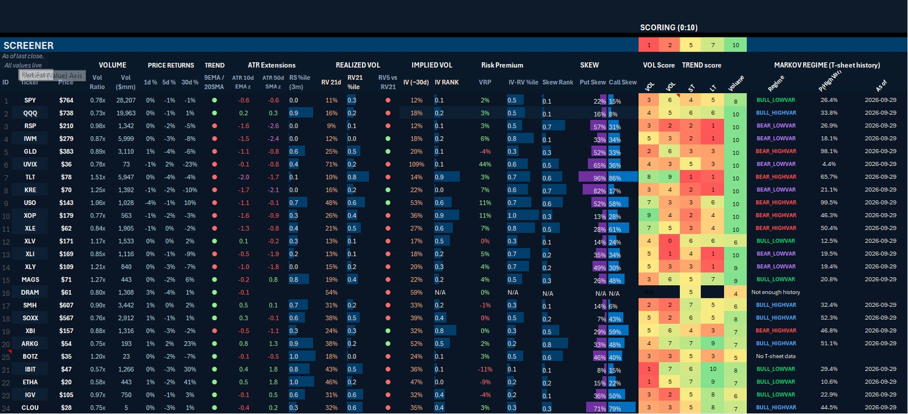
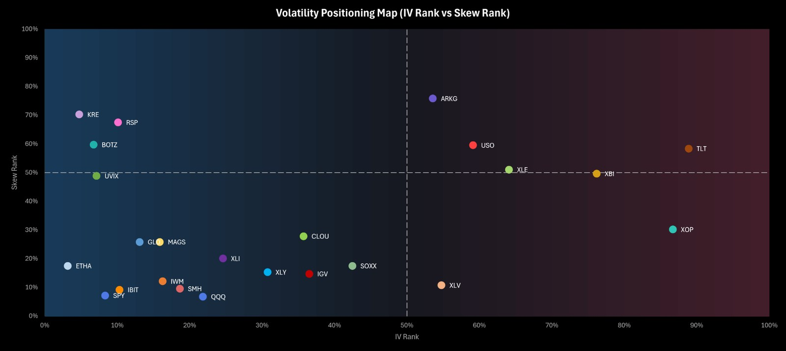
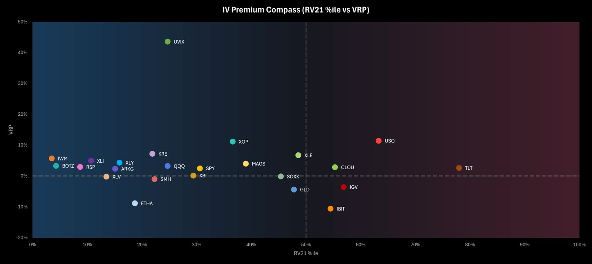
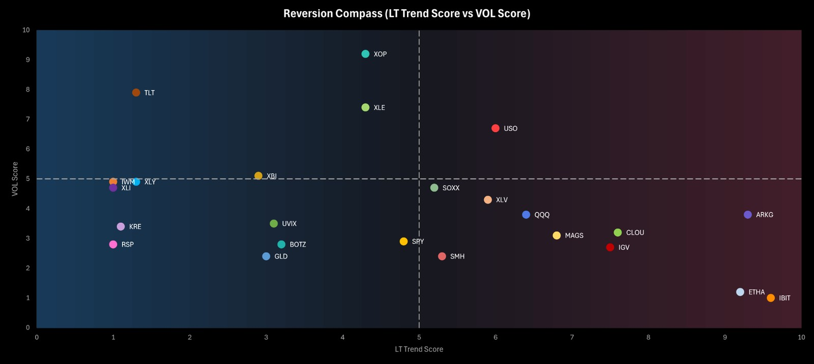
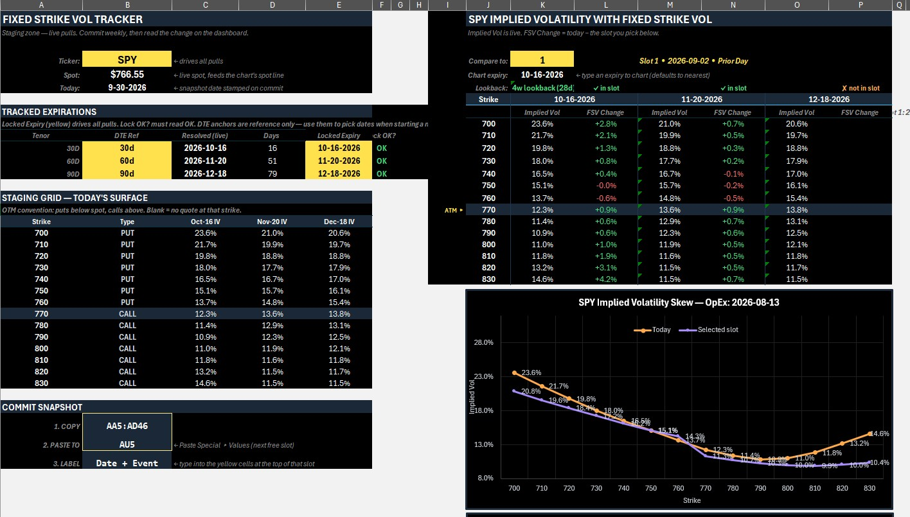
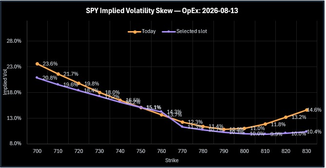
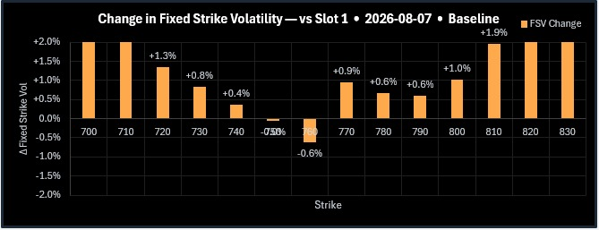

# Volatility Positioning Map

**Excel-based cross-sectional volatility screener for comparing implied volatility, realized volatility, skew, price extension, volume and regime context across 25 liquid ETFs/ETPs.**

> **Project status:** documented research model. The workbook is a research-context and relative-volatility tool, not a backtested strategy, portfolio system, or trade-signal engine. The screenshots below show the working interface and point-in-time model outputs; the repository does not redistribute the underlying vendor data feed.

## What the model does

The workbook puts several questions into one view:

- **Price / trend:** where is the ETF versus short- and long-horizon trend, expressed in ATR-normalized terms?
- **Realized volatility:** how volatile has the ETF actually been, and where does current RV sit versus its own recent history?
- **Implied volatility:** is option IV low or high relative to the name's own history?
- **Volatility risk premium:** is IV currently above or below recent realized volatility?
- **Skew:** how unusual is the shape of the option smile relative to the name's own history?
- **Regime:** is the ETF currently classified as bull/bear and low/high variance by the workbook's two-state volatility filter?

Selected measures are translated into **1–10 scores** and the ETF universe is plotted on three scatter maps. There is **no single composite rank** and no automatic buy/sell output.

## Universe

The current workbook covers 25 liquid ETFs/ETPs spanning broad equities, sectors, themes, rates, commodities, crypto and a leveraged volatility product:

SPY, QQQ, RSP, IWM, GLD, UVIX, TLT, KRE, USO, XOP, XLE, XLV, XLI, XLY, MAGS, DRAM, SMH, SOXX, XBI, ARKG, BOTZ, IBIT, ETHA, IGV and CLOU.

## Main screener

The dashboard combines price, volume, trend, realized volatility, implied volatility, risk-premium, skew, scoring and regime information in one cross-sectional view.

| Block | Purpose |
|---|---|
| Volume | 10-day volume ratio, dollar volume and a vendor volume-power score |
| Price returns | 1-, 5- and 30-trading-day returns |
| Trend / ATR extensions | EMA/SMA trend flag plus ATR-normalized z-scores |
| Realized volatility | RV21, RV21 percentile, RV5 vs RV21 and short-term RV trend |
| Implied volatility | ~30-day IV and IV Rank |
| Risk premium | VRP and IV-minus-RV percentile |
| Skew | Skew Rank plus put- and call-skew percentile fields |
| Scores | Vendor VOL, in-house VOL, short-term trend, long-term trend and volume scores |
| Regime | Bull/bear × low/high variance label, P(HighVar) and as-of date |

The dashboard is designed for **comparison**, not for reading any one metric in isolation.

## Volatility Positioning Map

The core chart crosses **IV Rank** on the x-axis with **Skew Rank** on the y-axis. The 50% lines divide the universe into four descriptive quadrants:

| Quadrant | Structural interpretation |
|---|---|
| Low IV Rank / Low Skew Rank | IV is low versus the name's own history and the smile is relatively flat |
| Low IV Rank / High Skew Rank | Overall IV is low, but option-wing pricing is relatively steep |
| High IV Rank / Low Skew Rank | IV is elevated, but pricing is relatively even across strikes |
| High IV Rank / High Skew Rank | IV is elevated and the wings are steep, consistent with concentrated hedging/stress demand |

These are **descriptions of current positioning**, not trade recommendations.

## IV Premium Compass

The IV Premium Compass crosses **RV21 percentile** against **VRP**.

- **X-axis — RV21 %ile:** where 21-day realized volatility sits versus its recent history.
- **Y-axis — VRP:** the vendor-supplied implied-minus-realized volatility premium.
- **Vertical divider:** 50th percentile of realized volatility.
- **Horizontal divider:** zero volatility premium.

This answers a different question from IV Rank: a name can have historically high IV but still not be especially rich relative to current realized volatility.

## Reversion Compass

The Reversion Compass crosses the workbook's **long-term trend score** against the **vendor VOL score**.

- **Low LT / Low VOL:** below long-term trend with subdued volatility context.
- **Low LT / High VOL:** below trend with elevated volatility context.
- **High LT / Low VOL:** above trend with subdued volatility context.
- **High LT / High VOL:** above trend with elevated volatility context.

Despite the chart name, the workbook does **not** implement an explicit mean-reversion rule. It is a contextual map combining price extension with volatility state.

## Fixed-Strike Volatility Tracker

The workbook also includes a separate single-ticker workflow for comparing **implied volatility at the same strikes across saved snapshots**.

The purpose is to distinguish a true repricing of implied volatility from a move that only appears because spot traveled along the smile. The user locks expiries, tracks the same strikes, and compares current IV with stored snapshot values.

### Skew comparison

### Change in fixed-strike volatility

The current implementation uses manual snapshot commits. The workbook audit also identified title/reference items that should be cleaned before a downloadable public workbook is released.

## Scoring framework

The score colors run from red through yellow to green, but **green means a higher score, not automatically a better trade**.

| Score | Calculation / interpretation |
|---|---|
| Vendor VOL | Vendor stock_vol_score × 10; exact vendor methodology is not documented in the workbook |
| In-house VOL | 10 × [0.4 × Φ(RV21 z-score) + 0.6 × RV10/RV21 trend percentile] |
| ST | Linear 1–10 mapping of the 10-day EMA ATR-extension z-score, clipped at the endpoints |
| LT | Same 1–10 mapping applied to the average 50-day and 200-day SMA ATR-extension z-scores |
| Volume | Vendor stock_volume_power × 10, clipped to 1–10 |

The trend scores measure **extension**, not “trend quality.” A high LT or ST score means price is unusually extended above its relevant trend reference.

## Selected methodology

### Realized volatility

Daily log returns are annualized as:

~~~text
RV = STDEV.S(daily log returns) × √252
~~~

The workbook calculates RV5, RV10, RV21, RV30 and RV63 internally. RV21 percentile uses the last 252 observations.

### ATR extension

The model expresses distance from moving averages in ATR units and then standardizes those extension series against recent history. Examples include:

~~~text
Short-term extension = (Close − EMA10) / ATR14
Long-term extension = (Close / SMA50 − 1) / (ATR14 / Close)
~~~

### Relative strength

Ticker and SPY daily moves are normalized by ATR, accumulated over 50 days and differenced. A 63-day percentile of the resulting relative-strength series is displayed.

### Regime filter

The regime block is **not a fitted Hidden Markov Model**. It is a two-state Gaussian forward filter built on daily log returns and rolling volatility, combined with an EMA/SMA trend flag.

The four displayed states are:

- BULL_LOWVAR
- BULL_HIGHVAR
- BEAR_LOWVAR
- BEAR_HIGHVAR

A P(HighVar) threshold of 0.30 separates low- and high-variance states. The regime output is currently display-only; it does not feed a score or trade rule.

**[Read the detailed methodology](docs/methodology.md)**

## How I use the model

1. **Refresh first.** Recalculate vendor functions, refresh PivotTables and confirm the as-of dates.
2. **Scan extremes.** Look for very low/high IV Rank, negative VRP, large ATR-extension z-scores and high-variance regime labels.
3. **Open the Positioning Map.** Compare implied-volatility level with skew shape.
4. **Open the IV Premium Compass.** Check whether implied volatility is actually rich/cheap relative to recent realized volatility.
5. **Open the Reversion Compass.** Put price extension beside the volatility context.
6. **Use the fixed-strike tracker** on a selected name to see whether IV has repriced at the same strikes.
7. **Add separate fundamental/thematic work.** The workbook contains no fundamental model and no position-sizing engine.

A low IV Rank does not automatically mean options are cheap, high skew does not imply a crash, and a score of 10 does not mean “buy.”

## Architecture

~~~mermaid
flowchart TD
    A[Dashboard ticker inputs] --> B[T1–T25 price-history sheets]
    C[Microsoft STOCKHISTORY] --> B
    B --> D[Indicators, RV, ATR, RS, percentiles and z-scores]
    D --> E[Data_Aggregate]
    E --> F[Dashboard]
    G[Options-volatility vendor fields] --> F
    H[Markov parameters] --> F
    F --> I[ScreenerFilter]
    I --> J[Chart_Data]
    J --> K[Three live scatter maps]
    I --> L[Pivot tables]
    L --> M[IV Rank / Skew Rank bar charts]
    G --> N[FIXED-STRIKE-VOL]
~~~

**[Read the workbook architecture](docs/architecture.md)**

## Data and publication notes

The technical audit identifies two live data dependencies:

- Microsoft Excel STOCKHISTORY for OHLCV history.
- Options Samurai for IV, IV rank, VRP, skew and vendor scores.

The underlying raw feeds are not included in this repository. A future downloadable public workbook should use a **synthetic/static demonstration dataset** unless redistribution rights are confirmed.

**[Read the data-source notes](docs/data-sources.md)**

## Known limitations

Important current limitations include:

- hard limit of 25 tickers;
- vendor definitions/lookbacks for several IV/skew fields are not documented in the workbook;
- IV Rank and Skew Rank bar charts depend on refreshed PivotTables and can become stale;
- price-history fields and intraday vendor fields can have different as-of times;
- IFERROR is used widely and can hide missing-data failures;
- short-history products can have incomplete percentile windows;
- UVIX, commodity products and crypto ETFs are structurally different from broad equity ETFs;
- the regime filter is heuristic rather than a fitted HMM and uses a 0.30 high-variance cutoff;
- the workbook contains several legacy/broken references and fixed-strike tracker items that should be cleaned before a public workbook release.

**[Read the full limitations and validation notes](docs/limitations.md)**

## Documentation

- [Workbook architecture](docs/architecture.md)
- [Methodology and score definitions](docs/methodology.md)
- [Data sources and publication notes](docs/data-sources.md)
- [Limitations and validation gaps](docs/limitations.md)
- [Publication checklist](PUBLICATION_CHECKLIST.md)

## Repository structure

~~~text
Volatility-Positioning-Map/
├── README.md
├── docs/
│   ├── architecture.md
│   ├── methodology.md
│   ├── data-sources.md
│   └── limitations.md
├── images/
│   ├── dashboard.jpg
│   ├── volatility-positioning-map.jpg
│   ├── iv-premium-compass.jpg
│   ├── reversion-compass.jpg
│   ├── fixed-strike-vol-workflow.jpg
│   ├── fixed-strike-vol-skew.jpg
│   └── fixed-strike-vol-change.jpg
└── PUBLICATION_CHECKLIST.md
~~~

---

**Research disclaimer:** This is a self-directed analytical project for research and demonstration. It is not investment advice, audited performance, a backtested strategy or an automated trading system.
